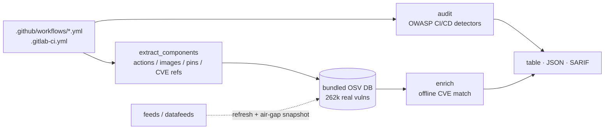

<a name="top"></a>
<div align="center">


# PIPEWATCH-PRO

### CI/CD supply-chain auditor — GitHub Actions / GitLab CI / OWASP CI/CD Top 10, with offline OSV vulnerability enrichment

[](https://pypi.org/project/cognis-pipewatch-pro/) [](https://github.com/cognis-digital/pipewatch-pro/actions) [](https://github.com/cognis-digital/pipewatch-pro/actions/workflows/ports.yml) [](LICENSE) [](https://github.com/cognis-digital)

*Find the supply-chain weaknesses in your pipelines before an attacker does — passive, offline, zero-dependency.*

</div>

```bash
pip install cognis-pipewatch-pro
pipewatch-pro audit .          # → prioritized OWASP CI/CD findings in seconds
pipewatch-pro enrich .         # → match pinned components against 262k offline CVEs
```

`pipewatch-pro` is a **passive, offline** auditor. It reads your pipeline files and component pins — it never performs network scanning or active probing.

## Contents

- [What it actually does](#what) · [Quick start](#quick-start) · [The `audit` command](#audit) · [The `enrich` command](#enrich) · [The `feeds` command](#feeds) · [Output formats](#formats) · [Edge / air-gap](#edge) · [Detectors](#detectors) · [Architecture](#architecture) · [Use from any AI stack](#ai-stack) · [Polyglot ports](#ports) · [Install anywhere](#install-anywhere) · [Scope & safety](#scope) · [Related](#related) · [Contributing](#contributing)

<a name="what"></a>
## What it actually does

PIPEWATCH-PRO parses CI/CD pipeline definitions — **GitHub Actions** (`.github/workflows/*.yml`) and **GitLab CI** (`.gitlab-ci.yml`) — and flags supply-chain weaknesses mapped to the **[OWASP CI/CD Top 10](https://owasp.org/www-project-top-10-ci-cd-security-risks/)**. The engine is pure standard library: a line-accurate text + light-structural pass, **no third-party YAML dependency**.

It also ships a **bundled, fully-offline vulnerability database** — a consolidated OSV corpus of **262,351 real records** across PyPI / npm / Go / Maven / RubyGems / crates.io / NuGet — so the `enrich` command can match the components your pipeline pulls (actions, container images, pinned `pip`/`npm` installs, CVE references) against known vulnerabilities **with no network and no API key**.

Two single-purpose commands, both passive:

| Command | What it answers |
|---|---|
| `audit`  | "Is my pipeline *configured* insecurely?" (unpinned actions, `curl\|bash`, hard-coded secrets, broad token scope, `pull_request_target`) |
| `enrich` | "Do the *components* my pipeline pulls have known CVEs?" (offline OSV match) |
| `feeds`  | Edge/air-gap manager to refresh the intel cache from NVD/OSV/GHSA and sneakernet it into a disconnected enclave |

<div align="right"><a href="#top">↑ back to top</a></div>

<a name="quick-start"></a>
## Quick start

```bash
pip install cognis-pipewatch-pro            # or: pipx install cognis-pipewatch-pro
pipewatch-pro --version                     # PIPEWATCH-PRO 0.3.4

pipewatch-pro audit .                       # audit the current repo's pipelines
pipewatch-pro audit . --format json | jq .  # machine-readable
pipewatch-pro audit . --format sarif        # GitHub code-scanning
pipewatch-pro audit . --fail-on critical    # CI gate (non-zero exit)

pipewatch-pro enrich .                       # offline CVE match on pulled components
pipewatch-pro enrich . --fail-on-match       # fail CI if any component is vulnerable
```

No clone? Run straight from git:

```bash
pip install "git+https://github.com/cognis-digital/pipewatch-pro.git"
python -m pipewatch_pro audit .
```

<div align="right"><a href="#top">↑ back to top</a></div>

<a name="audit"></a>
## The `audit` command — worked example

Given a deliberately risky workflow `.github/workflows/ci.yml`:

```yaml
name: ci
on:
  pull_request_target:          # exposes secrets to fork PRs
jobs:
  build:
    runs-on: ubuntu-latest
    steps:
      - uses: actions/checkout@v4                 # not pinned to a SHA
      - run: curl https://get.example.sh | bash   # remote code into a shell
      - run: echo ${{ secrets.TOKEN }}            # secret interpolated into a script
```

```text
$ pipewatch-pro audit .
PIPEWATCH-PRO 0.3.4 - CI/CD supply-chain audit
================================================================
[HIGH] CICD-SEC-01  `pull_request_target` trigger exposes secrets to fork PRs
        at .github/workflows/ci.yml
        evidence: on: pull_request_target
        fix: pull_request_target runs with repo secrets in the PR context. Avoid
             checking out / executing untrusted PR head code, or use pull_request.

[HIGH] CICD-SEC-04  Action not pinned to a full commit SHA
        at .github/workflows/ci.yml:8
        evidence: actions/checkout@v4
        fix: Pin to a full 40-char commit SHA instead of a mutable tag/branch.

[HIGH] CICD-SEC-07  Remote script piped directly into a shell
        at .github/workflows/ci.yml:9
        evidence: curl https://get.example.sh | bash
        fix: Download to a file, verify a checksum/signature, then execute.

[MED ] CICD-SEC-05  No explicit `permissions:` block (token defaults to broad scope)
        at .github/workflows/ci.yml

[MED ] CICD-SEC-06  Secret interpolated directly into run script
        at .github/workflows/ci.yml:10
        evidence: echo ${{ secrets.TOKEN }}
----------------------------------------------------------------
Total: 5  (high=3, medium=2)
Gating (critical+high): 3
$ echo $?
1
```

> A hard-coded secret like `API_KEY: AKIA…` (rather than a `${{ secrets.* }}`
> reference) raises an additional **critical** `CICD-SEC-06` finding, redacted in
> the output.

The exit code is **1** because findings at/above `--fail-on` (default `high`) exist — drop that into a CI step and insecure changes block the merge. Use `--fail-on never` to always exit `0` (report-only).

<div align="right"><a href="#top">↑ back to top</a></div>

<a name="enrich"></a>
## The `enrich` command — offline OSV match

`enrich` extracts the *named software components* a pipeline pulls and matches each against the bundled 262k-record OSV database — **fully offline**.

```yaml
jobs:
  build:
    container:
      image: log4j-core:2.14.1            # vulnerable container component
    steps:
      - run: pip install requests==2.5.0
      - run: echo "remediate CVE-2021-44228"
```

```text
$ pipewatch-pro enrich .
PIPEWATCH-PRO 0.3.4 - offline OSV enrichment
================================================================
components extracted: 3   vulnerability matches: 42
----------------------------------------------------------------
[CRITICAL] CVE-2021-44228  (Maven)
        component: log4j-core@2.14.1  [image]  at .github/workflows/ci.yml:4
        Remote code injection in Log4j
[CRITICAL] CVE-2021-45046  (Maven)
        component: log4j-core@2.14.1  [image]  at .github/workflows/ci.yml:4
        Incomplete fix for Apache Log4j vulnerability
[HIGH    ] CVE-2021-44832  (Maven)
        component: log4j-core@2.14.1  [image]  at .github/workflows/ci.yml:4
        Improper Input Validation and Injection in Apache Log4j2
        ...
```

What gets extracted:

| Source in the pipeline | `kind` | Example |
|---|---|---|
| `uses: owner/repo@ref` | `action` | `actions/checkout` |
| `image: name:tag` | `image` | `log4j-core:2.14.1` |
| `pip install pkg==ver` | `pip` | `requests==2.5.0` |
| `npm install pkg@ver` | `npm` | `lodash@4.17.4` |
| bare `CVE-…` / `GHSA-…` in text/comments | `cve-ref` | `CVE-2021-44228` |

`pipewatch-pro enrich . --fail-on-match` exits non-zero if any component matches a known vulnerability — a one-line offline gate for air-gapped pipelines.

<div align="right"><a href="#top">↑ back to top</a></div>

<a name="feeds"></a>
## The `feeds` command — keep the intel fresh

The bundled OSV corpus is the **offline baseline** so the tool has 262k vulns the moment it's cloned. To refresh or extend it, `pipewatch-pro feeds` wraps a keyless, stdlib-only data-feed manager over 35 real, recent intelligence sources (CISA KEV, EPSS, OSV, NVD, GHSA, MITRE ATT&CK, NIST OSCAL 800-53, abuse.ch, and more):

```bash
pipewatch-pro feeds list --domain vuln      # what's available
pipewatch-pro feeds update cisa-kev epss     # fetch + cache (online)
pipewatch-pro feeds get osv --offline        # serve from cache only
```

<div align="right"><a href="#top">↑ back to top</a></div>

<a name="formats"></a>
## Output formats

- **table** (default) — human-readable, severity-sorted, with evidence + remediation.
- **json** — `pipewatch-pro audit . --format json` → `{tool, version, summary, findings[]}` for dashboards/agents.
- **sarif** — `pipewatch-pro audit . --format sarif` → SARIF 2.1.0, directly consumable by GitHub code-scanning (upload via `github/codeql-action/upload-sarif`).

<div align="right"><a href="#top">↑ back to top</a></div>

<a name="edge"></a>
## Edge / air-gap

PIPEWATCH-PRO is built to run on disconnected, classified, or edge gear:

- **Core is stdlib-only** — `audit` and `enrich` have **zero pip dependencies** and never touch the network.
- **The vuln DB ships in the repo** (`pipewatch_pro/cognis_vulndb.jsonl.gz`) — clone once, enrich forever, offline.
- **Refresh on the connected side, sneakernet to the air gap:**
  ```bash
  # connected enclave
  pipewatch-pro feeds update cisa-kev epss osv nvd-cve
  python -m pipewatch_pro.datafeeds snapshot-export feeds.tar.gz
  # ── carry feeds.tar.gz across the air gap ──
  # disconnected enclave
  python -m pipewatch_pro.datafeeds snapshot-import feeds.tar.gz
  pipewatch-pro feeds get cisa-kev --offline
  ```
- Cache location is configurable with `COGNIS_FEEDS_CACHE`.

<div align="right"><a href="#top">↑ back to top</a></div>

<a name="detectors"></a>
## Detectors (OWASP CI/CD Top 10 coverage)

| Rule | Maps to | Severity | What it catches |
|---|---|---|---|
| `CICD-SEC-01` | Insufficient Flow Control | high | `pull_request_target` exposes repo secrets to fork PRs |
| `CICD-SEC-04` | Poisoned Pipeline Execution | high / **critical** | Action not pinned to a 40-char commit SHA (critical for `@main`/`@master`/`@latest` floating refs) |
| `CICD-SEC-05` | Insufficient PBAC | medium | No explicit `permissions:` block — `GITHUB_TOKEN` defaults to broad scope |
| `CICD-SEC-06` | Insufficient Credential Hygiene | **critical** / medium | Hard-coded credential (redacted in output); secret interpolated directly into a `run:` script |
| `CICD-SEC-07` | Insecure System Configuration | high | Remote script piped straight into a shell (`curl\|bash`) |

SHA-pinned actions, local (`./`) and `docker://` refs, `${{ secrets.* }}` references mapped through `env:`, and obvious placeholders (`changeme`, `xxxxxxxx`, `<token>`) are **not** flagged — designed to be low-noise.

<div align="right"><a href="#top">↑ back to top</a></div>

<a name="architecture"></a>
## Architecture



<div align="right"><a href="#top">↑ back to top</a></div>

<a name="ai-stack"></a>
## Use it from any AI stack

- **JSON** — pipe `pipewatch-pro audit . --format json` (or `enrich … --format json`) into any agent or LLM.
- **cognis-connect** — `pipewatch-pro-emit --to stix|misp|sigma|splunk|elastic|slack|webhook` forwards findings to your platform (soft dependency: `pip install "git+https://github.com/cognis-digital/cognis-connect.git"`).
- **MCP** — `pipewatch_pro/mcp_server.py` exposes the scan over MCP when `cognis-core` is installed (`pip install '.[mcp]'`).
- **CI / scripts** — exit codes + SARIF for non-AI pipelines.

<div align="right"><a href="#top">↑ back to top</a></div>

<a name="ports"></a>
## Polyglot ports

The primary `audit` command (the OWASP CI/CD detectors) is mirrored in three additional languages under [`ports/`](ports/), each a single zero-dependency binary with its own smoke test, built and tested on every push by the [`ports.yml`](.github/workflows/ports.yml) workflow:

| Language | Path | Run | Test |
|---|---|---|---|
| Go | [`ports/go`](ports/go) | `go run . <path>` | `go test ./...` |
| Rust | [`ports/rust`](ports/rust) | `cargo run -- <path>` | `cargo test` |
| Node.js | [`ports/javascript`](ports/javascript) | `node index.js <path>` | `node --test` |

All ports accept `--format json` and `--version`, and exit non-zero when a critical/high finding exists — drop the right binary into any CI runner without a Python toolchain.

<div align="right"><a href="#top">↑ back to top</a></div>

<a name="install-anywhere"></a>
## Install — every way, every platform

```bash
pip install cognis-pipewatch-pro                                          # PyPI
pip install "git+https://github.com/cognis-digital/pipewatch-pro.git"     # pip from git
pipx install "git+https://github.com/cognis-digital/pipewatch-pro.git"    # isolated CLI
uv tool install "git+https://github.com/cognis-digital/pipewatch-pro.git" # uv
docker run --rm ghcr.io/cognis-digital/pipewatch-pro:latest --help        # Docker
```

| Linux | macOS | Windows | Docker | Cloud |
|---|---|---|---|---|
| `scripts/setup-linux.sh` | `scripts/setup-macos.sh` | `scripts/setup-windows.ps1` | `docker run ghcr.io/cognis-digital/pipewatch-pro` | [DEPLOY.md](docs/DEPLOY.md) (AWS/Azure/GCP/k8s) |

<div align="right"><a href="#top">↑ back to top</a></div>

<a name="scope"></a>
## Scope, authorization & safety

PIPEWATCH-PRO is a **defensive, authorized-use** tool:

- **Passive and offline.** It reads pipeline files and component pins. It performs **no network scanning, no active probing, and no exploitation** of any kind.
- **No fabricated intelligence.** Enrichment matches only against the bundled, real OSV corpus (262k records) and the keyless public feed catalog — never invented CVEs or fingerprints.
- Run it on repositories you own or are authorized to audit.

<div align="right"><a href="#top">↑ back to top</a></div>

<a name="related"></a>
## Related Cognis tools

- [`depgraph`](https://github.com/cognis-digital/depgraph) — Dependency risk visualizer — Scorecard + OSV + typosquat + maintainer signals
- [`secretsweep`](https://github.com/cognis-digital/secretsweep) — Repo secret scanner + auto-rotator across providers
- [`ossaudit`](https://github.com/cognis-digital/ossaudit) — OSS license compliance auditor — AGPL contamination + NOTICE generation

**Explore the suite →** [🗂️ all tools](https://github.com/cognis-digital) · [🔗 cognis-connect](https://github.com/cognis-digital/cognis-connect)

<div align="right"><a href="#top">↑ back to top</a></div>

<a name="contributing"></a>
## Contributing

PRs, new detectors, and demo scenarios are welcome — see [CONTRIBUTING.md](CONTRIBUTING.md) and [SECURITY.md](SECURITY.md).

> ### ⭐ If `pipewatch-pro` saved you time, **star it** — it genuinely helps others find it.

## Interoperability

`pipewatch-pro` composes with the Cognis suite — JSON in/out and a shared findings contract via [cognis-connect](https://github.com/cognis-digital/cognis-connect). See **[INTEROP.md](INTEROP.md)**.

## License

Source-available under the **Cognis Open Collaboration License (COCL) v1.0** — free for personal, internal-evaluation, research, and educational use; **commercial / production use requires a license** (licensing@cognis.digital). See [LICENSE](LICENSE).

---

<div align="center"><sub><b><a href="https://cognis.digital">Cognis Digital</a></b> · part of the <a href="https://github.com/cognis-digital">Cognis Neural Suite</a> · <i>Making Tomorrow Better Today</i></sub></div>
